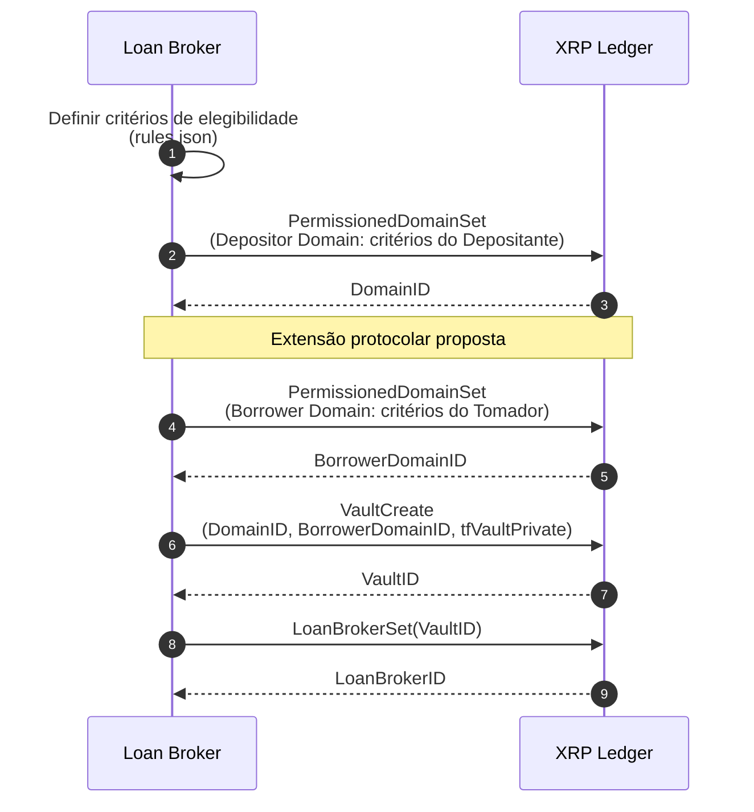
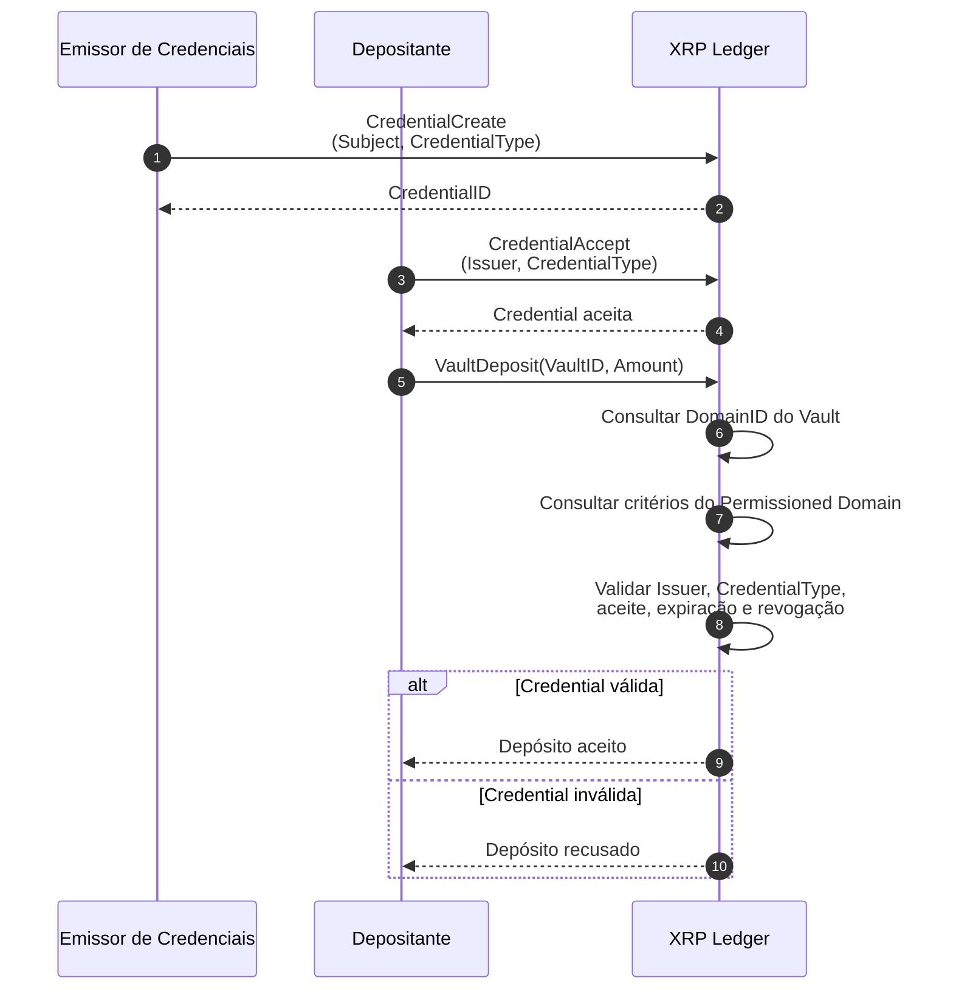
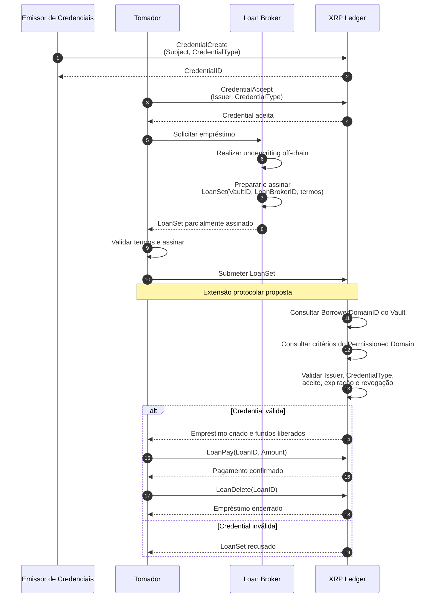

# Protótipo local do framework de credenciamento institucional

## Objetivo

O protótipo aplica o framework de identidade autossoberana ao *Lending Protocol* (XLS-66) do XRP Ledger (XRPL). Seu objetivo é controlar a participação de Depositantes e Tomadores por meio de atestações verificáveis, mantendo no ledger apenas os elementos necessários à autorização e à auditoria.

O ambiente é uma Prova de Conceito local e isolada. Ele permite criar contas, emitir e aceitar *Credentials*, configurar políticas de acesso e executar o ciclo de um empréstimo.

## Atores

- **Credential Issuer:** atesta que uma conta atende a um critério institucional.
- **Loan Broker:** administra o *Single Asset Vault*, define as políticas de elegibilidade e conduz o *underwriting*.
- **Depositante:** fornece liquidez ao *Vault* após satisfazer a política de acesso.
- **Tomador:** solicita o empréstimo, aceita seus termos e recebe os ativos.
- **XRP Ledger:** registra os objetos e executa as validações disponíveis no protocolo.

No *Lending Protocol* atual, o Loan Broker e o proprietário do *Vault* são a mesma conta.

## Ferramentas e tecnologias

| Elemento | Uso no protótipo |
|---|---|
| XRP Ledger e `rippled` | Ledger local e execução das transações do protocolo. |
| *Single Asset Vault* (XLS-65) | Custódia da liquidez e origem dos recursos emprestados. |
| *Lending Protocol* (XLS-66) | Criação, pagamento e encerramento dos empréstimos. |
| *Credential* (XLS-70) | Atestação on-chain vinculada ao *Credential Issuer*, ao titular e ao `CredentialType`. |
| *Permissioned Domain* (XLS-80) | Política de acesso formada por combinações aceitas de *Credential Issuer* e `CredentialType`. |
| *Decentralized Identifier* (DID, XLS-40) | Âncora de identidade prevista pelo framework teórico. |
| Docker | Compilação, execução do nó local, persistência do banco de dados e logs do ledger em volumes locais. |
| Python e `xrpl-py` | Orquestração das transações e dos papéis da aplicação. |
| JSON | Configuração da rede, das contas, do estado e das regras de elegibilidade. |

O repositório também mantém componentes de apoio para *Verifiable Credentials* (VCs), *Verifiable Presentations* (VPs) e IPFS. Esses componentes pertencem à camada de identidade off-chain e não são necessários para que o ledger local execute as transações do *Lending Protocol*.

## Organização das políticas

O arquivo `loan_broker/rules.json` separa as regras de **Depositante** e **Tomador**. Cada grupo admite múltiplos *Credential Issuers*, e cada emissor pode autorizar diferentes `CredentialTypes`. Cada par emissor-tipo representa uma alternativa válida de credenciamento.

A *Credential* só é utilizável depois de emitida pelo *Credential Issuer* e aceita pelo titular. Expiração ou revogação retira sua validade. Dados pessoais, financeiros e documentos completos permanecem off-chain; o ledger conserva somente a referência verificável necessária à decisão.

## Funcionamento atual

1. O Loan Broker cria um *Permissioned Domain* com os critérios aplicáveis ao Depositante.
2. O Loan Broker cria um *Single Asset Vault* privado associado ao `DomainID` e registra sua função por meio de `LoanBrokerSet`.
3. O *Credential Issuer* emite a *Credential* do Depositante, que a aceita antes de executar `VaultDeposit`.
4. O XRPL consulta o `DomainID` do *Vault* e valida on-chain o emissor, o `CredentialType`, o aceite e a expiração. O depósito somente é concluído se a política for satisfeita.
5. Para o Tomador, o *Credential Issuer* também emite uma *Credential*, posteriormente aceita pelo titular.
6. O Loan Broker realiza o *underwriting*, prepara e assina parcialmente `LoanSet`. O Tomador valida os termos, adiciona sua assinatura e submete a transação ao XRPL.
7. O ciclo termina com `LoanPay` e, quando aplicável, `LoanDelete`.

No estado atual, a regra do Tomador pertence à camada da aplicação: o `LoanSet` nativo não consulta um *Permissioned Domain* para validar suas *Credentials*.

## Extensão protocolar proposta

A evolução prevista cria dois *Permissioned Domains*: um para Depositantes e um *Borrower Domain* para Tomadores. O *Vault* continua associado ao `DomainID` do Depositante e passa a registrar o identificador do segundo domínio em `BorrowerDomainID`.

Nessa extensão, `LoanSet` recebe o `VaultID`. Durante a execução, o XRPL localiza o *Vault*, obtém seu `BorrowerDomainID` e valida on-chain se o Tomador possui ao menos uma *Credential* aceita, não expirada e compatível com a política. Assim, a autorização deixa de depender exclusivamente do fluxo off-chain da aplicação e passa a ser uma condição determinística da originação do empréstimo.

Essa alteração ainda não está incorporada ao núcleo do `rippled` presente no protótipo.

## Diagramas de sequência

Os diagramas abaixo representam o fluxo completo pretendido.

### Configuração do Lending Protocol

### Autorização do Depositante

### Autorização do Tomador

## Ambiente local

O `rippled` é compilado a partir do código-fonte mantido em `xrpl-module` e executado em modo *standalone*. Um serviço auxiliar fecha ledgers periodicamente. A API JSON-RPC é exposta apenas no endereço local, enquanto volumes nomeados preservam o ledger e os logs. Os arquivos de `xrpl-module/config` descrevem a rede e as contas de desenvolvimento sem substituir o estado mantido pelo próprio ledger.
