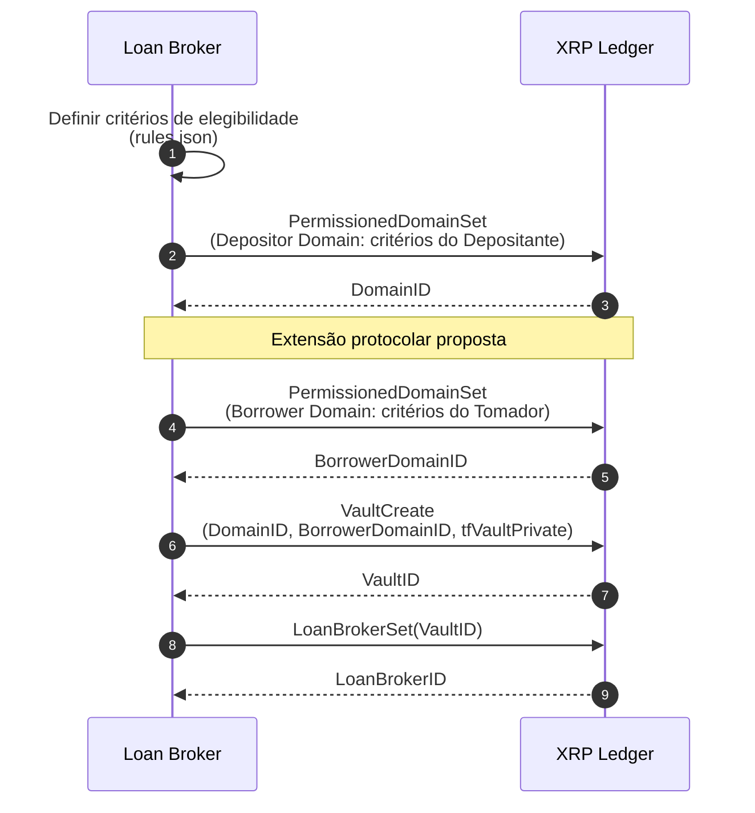
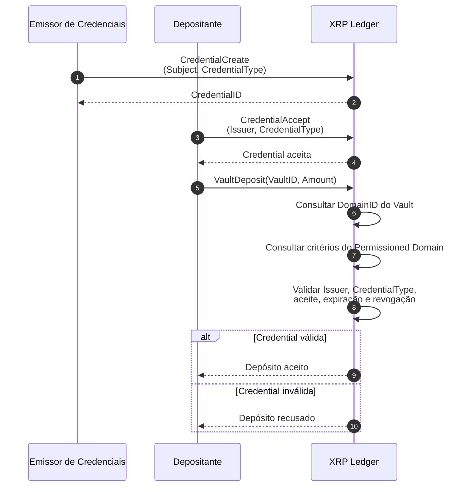
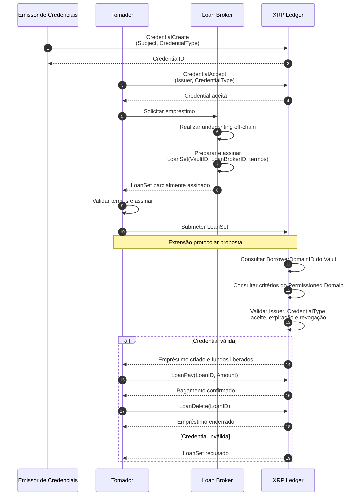
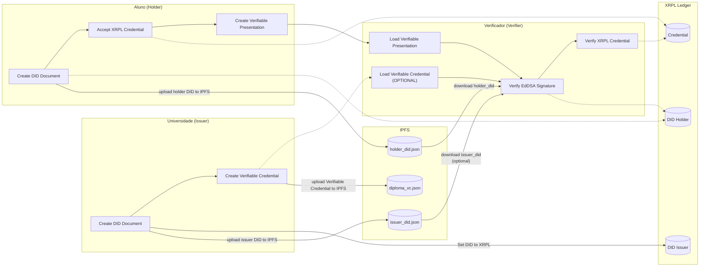
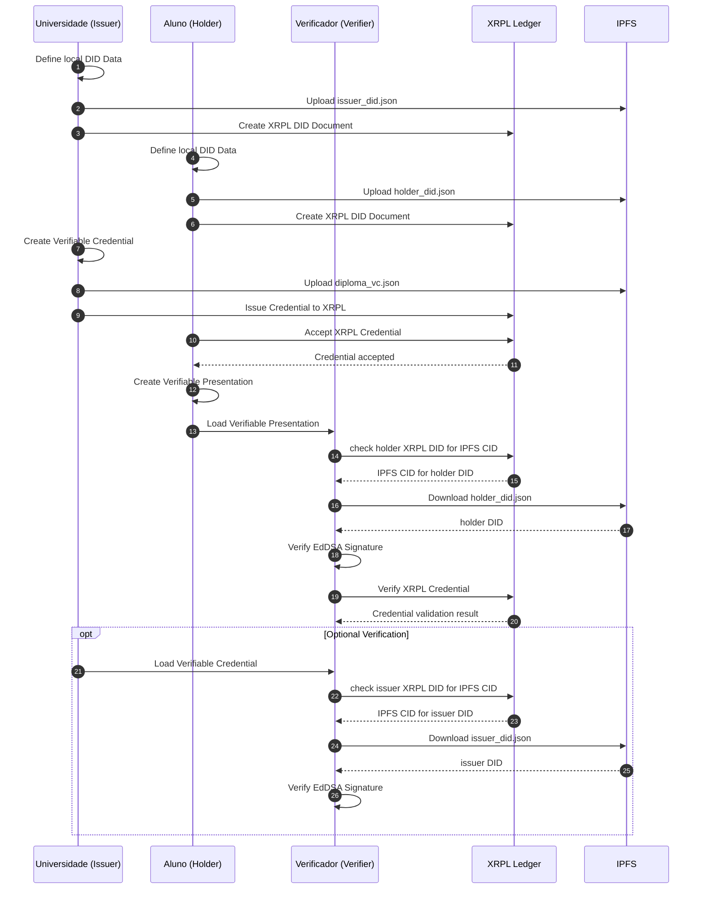

# Implementação do XRPL Lending Protocol

### Configuração do Lending Protocol



### Autorização do Depositante



### Autorização do Tomador



## Loan Broker

### Criação do Permissioned Domain

```
python loan_broker/create_permissioned_domain.py
```

### Criação do Private Vault associado ao DomainID

```
python loan_broker/create_private_vault.py
```

### Definição do Loan Broker associado ao Vault:

```
python loan_broker/set_permissioned_loan_broker.py
```

## Issuer

### Emissão da credential associada ao Depositor:

```
python credential_issuer/issue_credential.py depositor
```

## Depositor

### Aceitação da credential emitida pelo Issuer:

```
python depositor/accept_credential.py
```

### Adição de liquidez ao Vault:

```
python depositor/deposit_to_private_vault.py
```

## Issuer

### Emissão da credential associada ao Borrower: 

```
python credential_issuer/issue_credential.py borrower
```

## Borrower:

### Aceitação da credential emitida pelo Issuer:

```
python borrower/accept_credential.py
```

## Loan Broker:

### Preparação do empréstimo e validação da credential:

```
python loan_broker/prepare_loan.py
```

## Borrower:

### Assinatura e submissão do empréstimo:

```
python borrower/sign_submit_loan.py
```

### Quitação do empréstimo:

```
python borrower/pay_loan.py
```

### Remoção do empréstimo finalizado:

```
python borrower/delete_loan.py
```

# XRPL

Implementação das roles de Holder, Issuer e Verifier no ledger XRPL.

# Como utilizar?

>Ambiente Virtual (Opcional)
><details>
><summary> Windows: </summary>
>
>### Criando o ambiente virtual
>
>```
>python -m venv .venv
>```
>
>### Inicializando o ambiente virtual
>
>```
>source .venv/Scripts/activate
>```
>
></details>

## Instalando dependências
```
pip install -r requirements.txt
```

## Definindo variáveis de ambiente
```
cp .env.example .env
```

## Inicialização do container IPFS
```
docker compose -f ipfs/docker-compose.yaml up -d
```

><details>
><summary>Testando o container (Opcional)</summary>
>
>```
>curl -X POST http://127.0.0.1:5001/api/v0/version
>```
>
></details>

## Inicializando a Interface Visual
Acessível em `127.0.0.1:8080` ou `localhost:8080`. A porta pode ser alterada pela variável `GUI_PORT` no arquivo `.env`
```
python gui/ui.py
```


## Diagrama de fluxo das operações



## Diagrama de Sequência das operações


## Execução das roles

### Issuer (Universidade)

#### 1. Definir documento DID local
Define dados locais do DID `issuer_did.json` em `issuer/documents/` e faz upload para IPFS.
```
python issuer/define_local_did_data.py
```

#### 2. Criar documento DID no XRPL ledger 

```
python issuer/xrpl_did/create_did_document.py
```

#### 3. Criar Verifiable Credential (VC)
Cria documento `diploma_verifiable_credential.json` em `issuer/documents/` e faz upload para IPFS.

```
python issuer/create_verifiable_credential.py
```

#### 4. Criar objeto Credential no XRPL ledger

```
python issuer/xrpl_credential/issue_credential.py
```

>[!Note]
>1. e 3. retornam CID do documento, por exemplo ```CID: QmU6ua7J66nUqvLyCN2iERLyNCs9M2C8hZwS9AhFo3fQuW``` e salvam no arquivo de logs em ```issuer/logs/logfile.jsonl``` 

><details>
><summary>Consultar/Deletar DID (Opcional)</summary>
>   
> 1. Consultar (Retorna objeto DID do ledger) 
>
>```
>python issuer/xrpl_did/check_did.py
>```
>
> 2. Deletar (Exclui objeto DID do ledger) 
>
>```
>python issuer/xrpl_did/delete_did.py
>```
>
></details>

### Holder (Aluno)

#### 5. Definir documento DID local
Define dados locais do DID `holder_did.json` em `holder/documents/` e faz upload para IPFS
```
python holder/define_local_did_data.py
```

#### 6. Criar documento DID no XRPL ledger
```
python holder/xrpl_did/create_did_document.py
```

#### 7. Aceitar credencial XRPL

  >[!Warning]
  > Credencial deve ter sido emitida pelo Issuer antes de poder ser aceita.
```
python holder/xrpl_credential/accept_credential.py
```

#### 8. Criar Verifiable Presentation (VP)
Cria documento `diploma_verifiable_presentation.json` em `holder/documents/`
  >[!Warning]
  > Credencial deve ter sido emitida pelo Issuer antes de poder ser referenciada na VP.
```
python holder/create_verifiable_presentation.py
```

><details>
><summary>Consultar/Deletar DID (Opcional)</summary>
>   
> 1. Consultar (Retorna objeto DID do ledger) 
>
>```
>python holder/xrpl_did/check_did.py
>```
>
> 2. Deletar (Exclui objeto DID do ledger) 
>
>```
>python holder/xrpl_did/delete_did.py
>```
>
></details>

### Verifier

#### 9. Verificar a validade da assinatura EdDSA da VP
  >[!Warning]
  > VP deve ter sido criada pelo Holder (5) para ser verificada.
   ```
   python verifier/verify_vp_signature.py
   ```
#### 10. Verificar a validade da credencial XRPL
  >[!Warning]
  > Credencial deve ter sido emitida pelo Issuer e aceita pelo Holder.
   ```
   python verifier/verify_xrpl_credential.py
   ```

><details>
><summary>Verificar a validade da assinatura EdDSA da VC (Opcional)</summary>
>    
>
>```
>python verifier/verify_vc_signature.py
>```
>
></details>